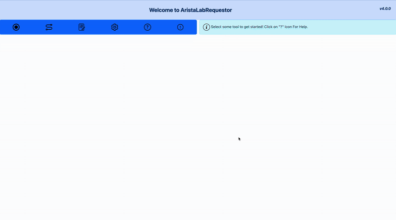
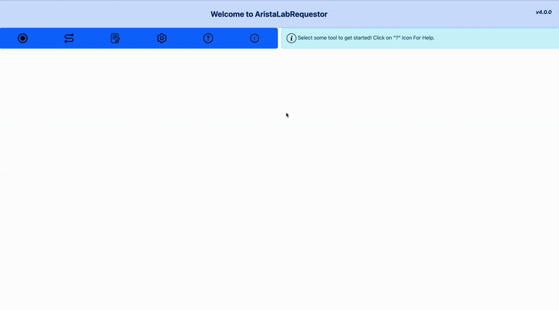
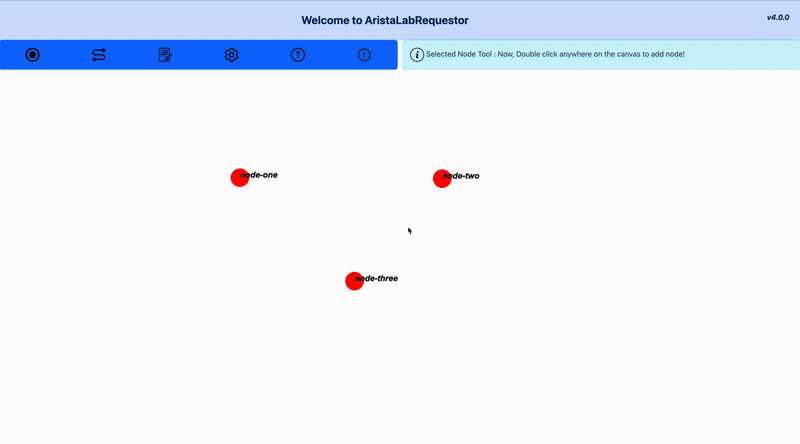
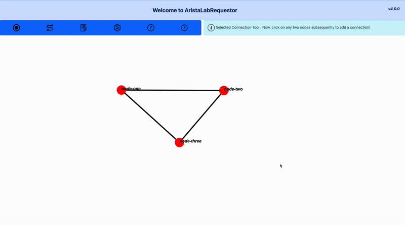
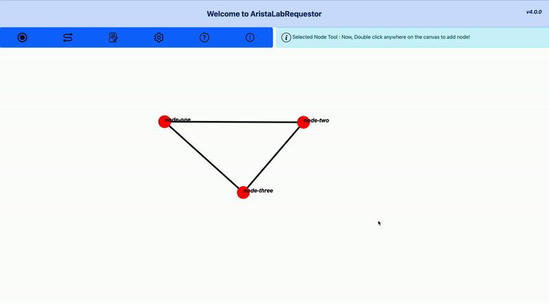
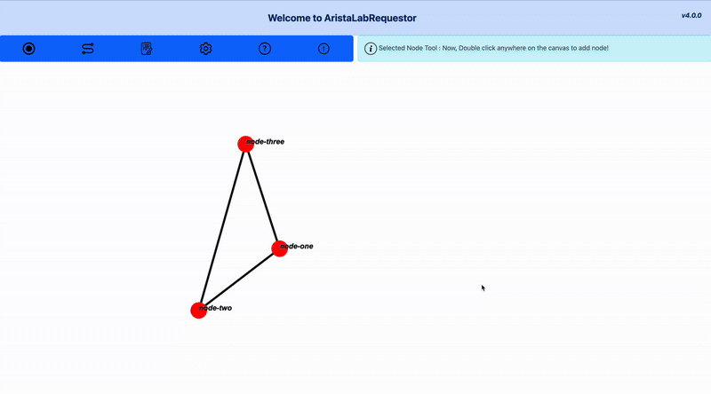
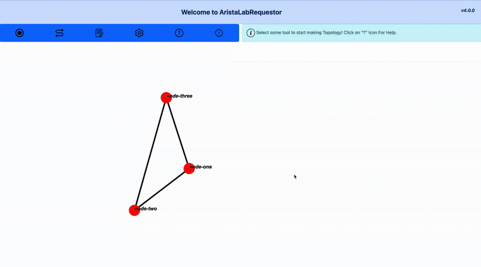

# AristaLabRequestor 
This is Hackathon BrewIT'24 Project. The primary goal of this app was to help Systest Team to make Lab Requests with visual interface to get rid of time consuming and manual work of drafting Lab Requests.

## 🌐 Overview

AristaLabRequestor is a web application designed to streamline the process of managing and generating network lab configurations, specifically tailored for Arista ACT Labs and SysTest Team lab requests. It provides a visual interface for editing existing YAML-based lab topologies and facilitates the creation of new lab requests, significantly enhancing efficiency and reducing manual errors in lab setup workflows.

## ✨ Features

* **Visual ACT Lab Topology Editor:**
    * **Load Existing Configurations:** Easily import existing ACT Lab YAML configuration files directly into the application.
    * **Interactive Canvas:** Visually represent and manipulate network topologies on an intuitive canvas. Drag, drop, connect, and configure devices with ease.
    * **Real-time Editing:** Modify device configurations, interface connections, and other topology parameters through a user-friendly graphical interface.
    * **Download Updated YAML:** Export the visually edited lab topology back into a standard ACT Lab YAML file, ready for deployment or version control.

* **SysTest Lab Request Generator:**
    * **Streamlined Request Creation:** Generate standardized lab requests for the SysTest Team, ensuring all necessary information is captured consistently.
    * **Automated Formatting:** Reduce manual effort and potential errors in formatting lab request documents.

* **User-Friendly Settings Menu:**
    * Customize application preferences for a personalized and efficient workflow.

* **Upcoming Feature: Load Existing SysTest Lab Requests:**
    * The ability to import and review previously generated SysTest Lab Request files will be added soon, providing a comprehensive history and easy modification of past requests.

## 🚀 Getting Started

These instructions will get you a copy of the project up and running on your local machine for development and testing purposes.

### Prerequisites

Just in case you're into testing.
* `NodeJS`
* `Cypress`

Otherwise knowledge of `git` and `javascript` is enough.

### Installation

1. **No Need to Install**
    Just access it from this [URL](henilmistry.github.io/AristaLabRequestor/)

2.  **Clone the repository:**
    ```bash
    git clone https://github.com/HenilMistry/AristaLabRequestor.git
    cd AristaLabRequestor
    ```

3.  **Install dependencies:**
    * Install NodeJS
    * Install Cypress 

## 💡 Usage Guide

### 1. Loading an ACT Lab YAML File



1.  Click on the "Settings" button in the application interface.
2.  Click on "Upload" (Gree Coloured) button from "Topology Configuration" section.
3.  From "Upload Topology" modal, select the type of file as "Existing YAML".
4. Click on "Upload Topology" button and select the file which you want to upload.

### 2. Editing the Topology

#### Adding Nodes


#### Adding Connections


#### Managing Connections


#### Drag and Drop Node Management



1.  **Drag & Drop:** Move devices around the canvas to rearrange the layout.
2.  **Add Devices/Connections:** Use the toolbox (Node Tool) to add new devices or draw connections (Connection Tool) between existing ones.
3.  **Configure Devices:** Double Click on a device (Nodes) to open its configuration panel. Edit parameters and configure.
4.  **Edit Connections:** From Node Configuration, Click on a connection to modify its properties (e.g., link type, bandwidth).

### 3. Downloading the Updated YAML



1.  Once you're satisfied with your edits, click on "Settings" Tool.
2.  Make sure that you have selected "ACT Lab - YAML File" for Code Generation Format under "Topology Configuration" Section.
3. Now click on "Save Settings" to save.
4. Once done, you can click on "Output Tool" which will prompt you the output of currect topology.
5. You can click on "Copy to clipboard" button to copy that file.

### 4. Generating a SysTest Lab Request

See Above for a video demo.

1.  Add Nodes, Add Connections.
2.  Once you're ready with your topology, click on "Output Tool".
3.  You can click on "Copy to clipboard" button to copy that file.

### 5. Using the Settings Menu



1.  Access the "Settings" tool for Tools Section.
2.  You can configure Key Shortcuts for certain actions from "Key Bindings" section.
3. You can choose the custom node images from "Canvas Utilities" section.
4. You can manage saved topologies or load existing once using "Topology Configuration" section.

## 🤝 Contributing

We welcome contributions to AristaLabRequestor! If you'd like to contribute, please follow these steps:

1.  Fork the repository.
2.  Create a new branch (`git checkout -b feature/your-feature-name`).
3.  Make your changes.
4.  Commit your changes (`git commit -m 'Add new feature'`).
5.  Push to the branch (`git push origin feature/your-feature-name`).
6.  Open a Pull Request.

Please ensure your code adheres to the project's coding standards and includes appropriate tests.

---

**Developed with ❤️ by Henil Mistry**
